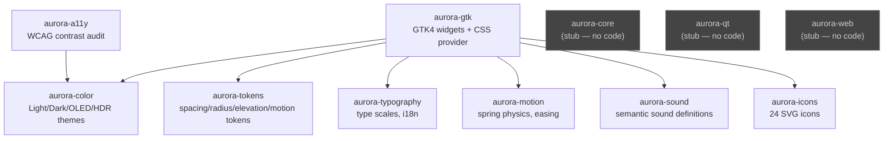

# Architecture

This describes the actual, current crate graph of this workspace — derived
directly from each crate's `Cargo.toml` (`grep -oE '^aurora-[a-z0-9]+'
crates/*/Cargo.toml`), not from a design document. For status (what's
real vs. not implemented), see the root [README.md](../../README.md)'s
"What's real today" table and [ROADMAP_HONEST.md](../../ROADMAP_HONEST.md).

## Crate dependency graph



`aurora-tokens`, `aurora-typography`, `aurora-color`, `aurora-motion`,
`aurora-icons`, and `aurora-sound` have **no dependencies on each other or
on `aurora-gtk`** — each is an independent, standalone crate that can be
used without pulling in GTK4. `aurora-gtk` is the only crate that depends
on the others, and only it depends on the system `gtk4`/`glib` crates.
`aurora-core`, `aurora-qt`, and `aurora-web` are empty stub crates with no
implementation and no dependencies — see `ROADMAP_HONEST.md`.

## Inside `aurora-gtk`

```
crates/aurora-gtk/src/
├── widgets/       # Button, Input, Checkbox, Card, Switch have .build() -> real gtk4 objects.
│                  # DataTable, Tabs, Menu, Dialog, List, Select, Sidebar, Badge,
│                  # Breadcrumb, Radio, Tooltip, IconDock have styling/state logic
│                  # only — no .build(), do not construct gtk4 objects.
├── css.rs         # CssProvider: renders aurora-tokens into a real gtk4::CssProvider
├── theme.rs       # Theme enum (Light/Dark/OLED/HDR), wraps aurora-color
├── icons/         # Resolves aurora-icons SVGs to widget icon metadata
├── accessibility/ # Wraps aurora-a11y's contrast checks for widget-level use
├── motion/        # Wraps aurora-motion for widget animation
├── storybook/     # In-process component catalog/documentation data, not a real Storybook build
├── gnome/         # dconf.rs, notifications.rs, observer.rs, settings_panel.rs —
│                  # data models only. No gio/zbus/D-Bus dependency exists in
│                  # Cargo.toml; nothing here performs real dconf writes, real
│                  # D-Bus calls, or reads real GNOME Settings state. Do not
│                  # describe this as "GNOME Settings integration" without that
│                  # caveat — see ROADMAP_HONEST.md.
└── cli/           # Command/CommandType data structures for an imagined `aurora`
                   # CLI. No [[bin]] target, no clap dependency, no fn main
                   # reading argv anywhere in this workspace — not a runnable tool.
```

## Why no architecture diagram existed before this

`docs/` previously contained two conflicting, pre-written architecture
docs (`ARCHITECTURE.md`, `ARCHITECTURE_V2.md`) describing a much larger,
partially fictional system (1000+/2000+ icons, `libadwaita` integration,
GDM/notification-daemon integration) that was never built. Both were
moved to `docs/archive/` rather than corrected in place, because
correcting them would have meant rewriting nearly every claim in them.
This file replaces them with something derived mechanically from the
actual `Cargo.toml` graph instead.
